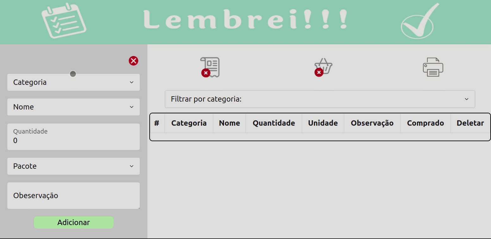
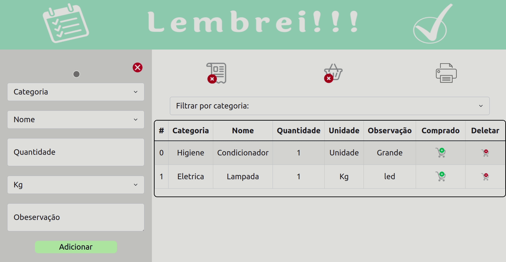
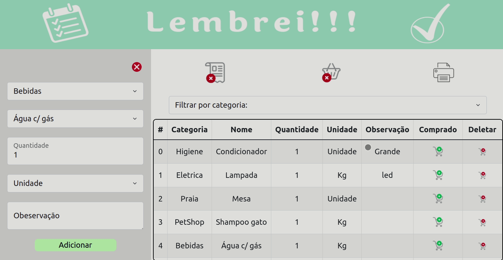
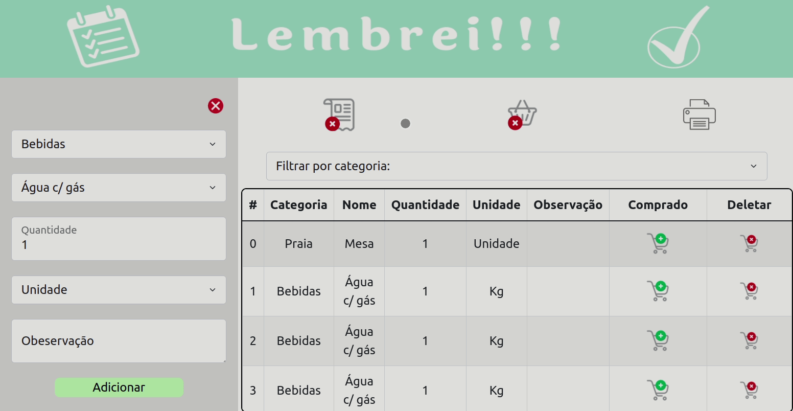

<h1 align="center">Lembrei!!! - Lista de Compras</h1>
<h4 align="center"> 
	🚧  Lembrei!!! - Lista de Compras 🚀 Finalizado  🚧
</h4>
<br>
<h2>Sobre</h2>
<p align="justify"> Lembrei!!! - Lista de Compras - É uma aplicação desenvolvida para
que aqueles momentos que estamos fazendo nossas compras e simplismente esquecemos o que comprar, ou quando chegamos em casa e percebemos que esquecemos de varios itens, nunca mais aconteça. </p 

### Features

-  Cadastro de compras
-  Escolha por categorias
-  Possibilidade de categorias personalizadas
-  marcação de compras já realizadas
-  Compras salvas localmente
-  Filtrar as compras cadastradas por categoria
-  Possibilidade de salvar a lista e assim imprimir ou compartilhar
<br>
## 🛠 Tecnologias

As seguintes ferramentas foram utilizadas na construção do projeto:

- [React](https://pt-br.reactjs.org/)
- [JavaScript](https://developer.mozilla.org/en-US/docs/Web/JavaScript/Language_Resources)
- [React-BootStrap](https://react-bootstrap.github.io/)
- [Node.js](https://nodejs.org/en/)

<h2>Testar o projeto</h2>
<h4>Clique na imagem abaixo</h4>
<br>
<div align="center">
<a  href="https://lembrei.vercel.app/" target="_blank"></a> 
</div>
<br>
<h2>Instalar o projeto em sua máquina</h2>
<br>
<h3>Pré-requisitos</h3>

Antes de começar, você vai precisar ter instalado em sua máquina as seguintes ferramentas:
[Git](https://git-scm.com) e [Node.js](https://nodejs.org/en/). É necessário a utilização de um editor de código, e como recomendação deixo o [VSCode](https://code.visualstudio.com/).


###  Rodando a aplicação web.

```bash
# Clone este repositório
# Foi utilizado SSH
$ git clone git@github.com:MarcoMecenasFilho/lembrei.git

# Acesse a pasta do projeto no seu terminal/cmd
$ cd lembrei
# Instale as dependências
$ npm install

# Execute a aplicação em modo de desenvolvimento
$ npm run dev

# A aplicação será aberta na porta:3000 - acesse http://localhost:3000
```
<h2>Utilizando a aplicação</h2>
<p align="justify"> - A aplicação funcionada de maneira muito simples. Temos um formulário e uma tabela. Para adicionar uma compra, basta preencher os campos e clicar em salvar.</p>

<br>
<p align="justify"> - Para criar uma categoria personalizada basta clicar em outros. Assim sera possível
digitar o nome da categoria e do produto. Mas caso a categoria exista e o produto desejado não, basta clicar em outros no nome que sera possível digitar o produto personalizado. </p>

<br>
<p align="justify"> - Dentro da tabela de compras, é possível marcar e desmarcar como comprado e excluir aquela compra.</p>

<br>
<p align="justify"> - Com os botões superiores, é possível abrir e fechar o formulário, limpar a tabela e imprimir a lista. </p>

<br>
<p align="justify"> - Para obter um bom documento para imprimir ou compartilhar a lista, é necessario selecionar o melhor layout, sendo paisagem ou retrato.</p>

<br>


 - Este projeto foi feito com muita dedicação e carinho por Marco Mecenas  [Entre em contato!](https://www.linkedin.com/in/marcomecenasfilho/).
